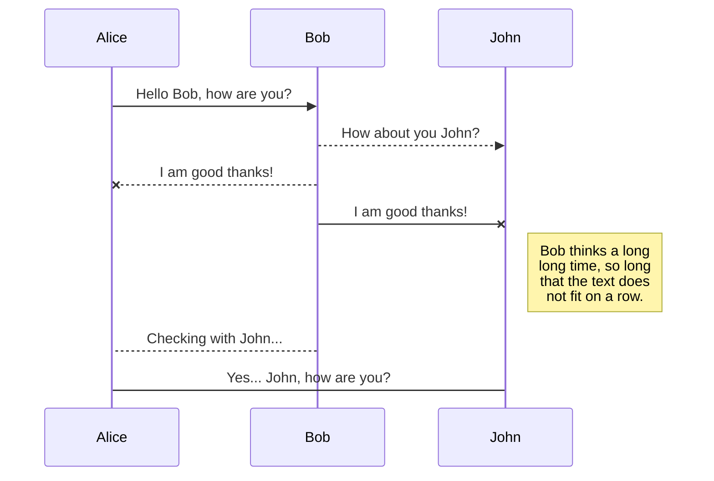
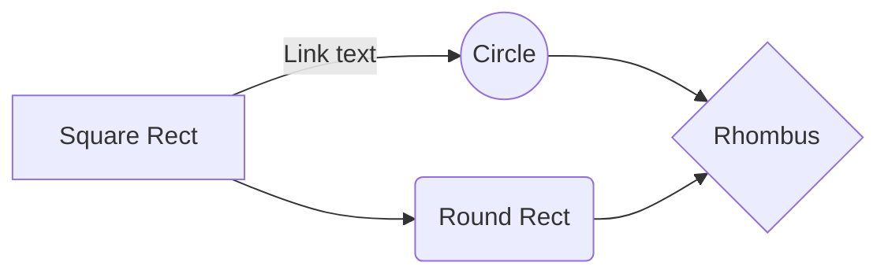

---
title: 첫번째 테스트
date: 2022-11-20 21:57:00 +0900
categories: [Blogging, Tutorial]
tags: [첫번째, 테스트]
math: True
mermaid: True
---

# 첫 게시글 테스트입니다.

안녕하세요 **수빅**입니다. 깃허브로 블로그 만들기를 테스트 하고 있는데 쉽지 않네요..
- jekyll-theme의 [Chripy](https://jekyll-themes.com/chirpy/) 테마를 이용했습니다.
- 참고한 사이트들입니다. 
-- <https://seong6496.tistory.com/258?category=1009671>
-- <https://www.irgroup.org/posts/jekyll-chirpy/>
-- <https://www.irgroup.org/posts/Chirpy-%ED%85%8C%EB%A7%88-%EC%BB%A4%EC%8A%A4%ED%84%B0%EB%A7%88%EC%9D%B4%EC%A7%95/>
-- <https://zerozoo-a.github.io/error/2022/09/04/bug.html>
-- <https://j1mmyson.github.io/posts/postingGuide/>
-- <https://velog.io/@hashnsalt/Github-Blog-%EB%A7%8C%EB%93%A4%EA%B8%B0-2>
> **감사**합니다!!

이것저것 테스트 해봐야겠다.

|                |ASCII                          |HTML                         |
|----------------|-------------------------------|-----------------------------|
|Single backticks|`'Isn't this fun?'`            |'Isn't this fun?'            |
|Quotes          |`"Isn't this fun?"`            |"Isn't this fun?"            |
|Dashes          |`-- is en-dash, --- is em-dash`|-- is en-dash, --- is em-dash|

## KaTeX

You can render LaTeX mathematical expressions using [KaTeX](https://khan.github.io/KaTeX/):

The *Gamma function* satisfying $\Gamma(n) = (n-1)!\quad\forall n\in\mathbb N$ is via the Euler integral

$$
\Gamma(z) = \int_0^\infty t^{z-1}e^{-t}dt\,.
$$

> You can find more information about **LaTeX** mathematical expressions [here](http://meta.math.stackexchange.com/questions/5020/mathjax-basic-tutorial-and-quick-reference).

## UML diagrams

You can render UML diagrams using [Mermaid](https://mermaidjs.github.io/). For example, this will produce a sequence diagram:

And this will produce a flow chart:

# 마지막..
- 앞으로 잘 배워서 이것저것 리뷰해보겠습니다. 감사합니다!

첫글 테스트 끝!

